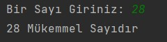
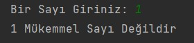
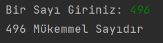

# Mükemmel Sayı Bulma
Klavyeden girilen bir sayının mükemmel sayı olup/olmadığını bulan ve sayı mükemmel sayı ise ekrana “mükemmel sayıdır.” değilse “mükemmel sayı değildir.” ifadelerini ekrana yazan programı Java dilinde yazınız.
## Mükemmel Sayı Nedir ?
Bir sayının kendisi hariç pozitif tam sayı çarpanları (kalansız bölen sayıların) toplamı kendisine eşit olan sayıya mükemmel sayı denir.
## Senaryolar

